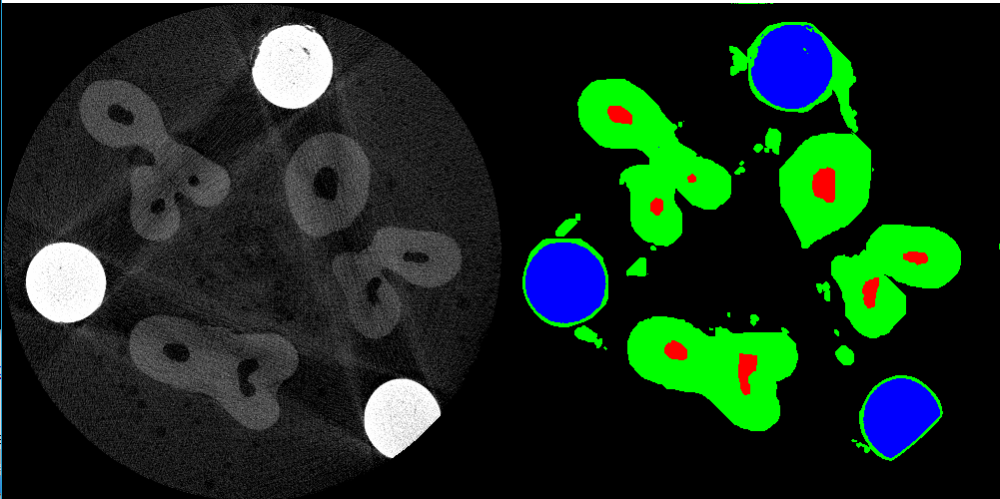
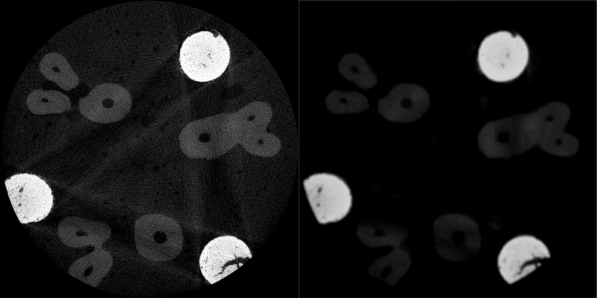

# trabalho2-computacao-grafica

> O objetivo deste trabalho é realizar a segmentação de estruturas de dentes em imagens de MicroCT, usando técnicas de segmentação por limiar e segmentação por regiões.

### Resultados alcançados:

